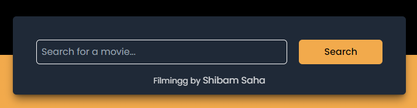
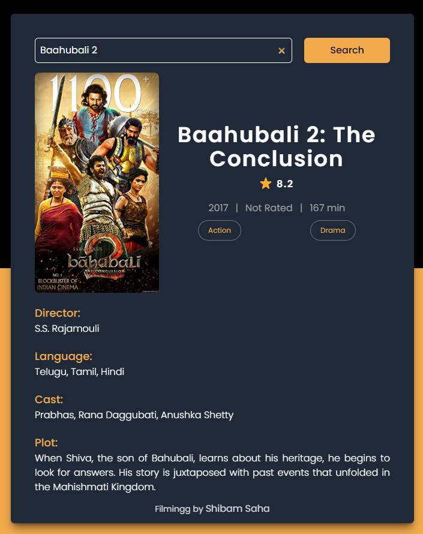
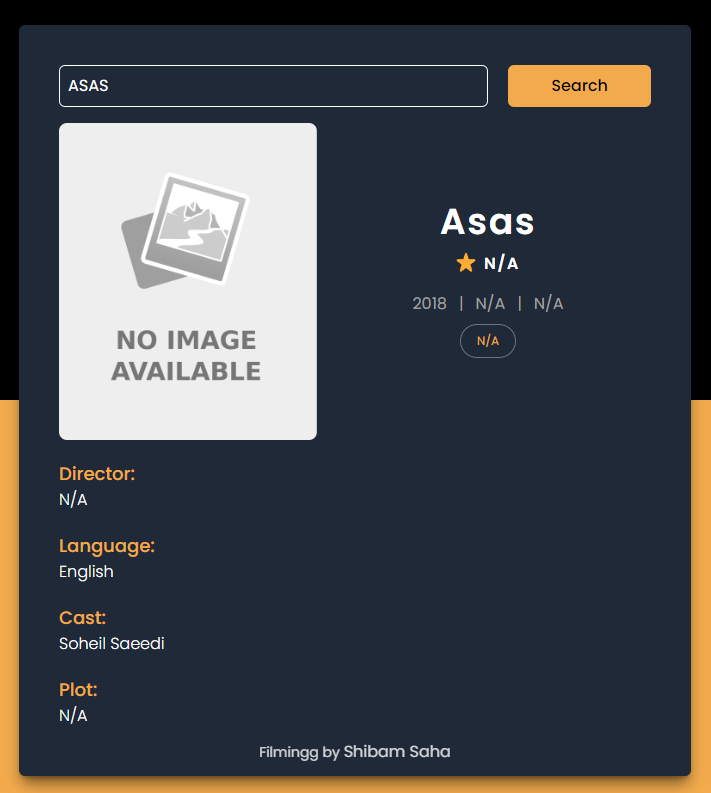
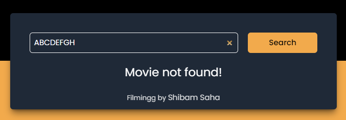
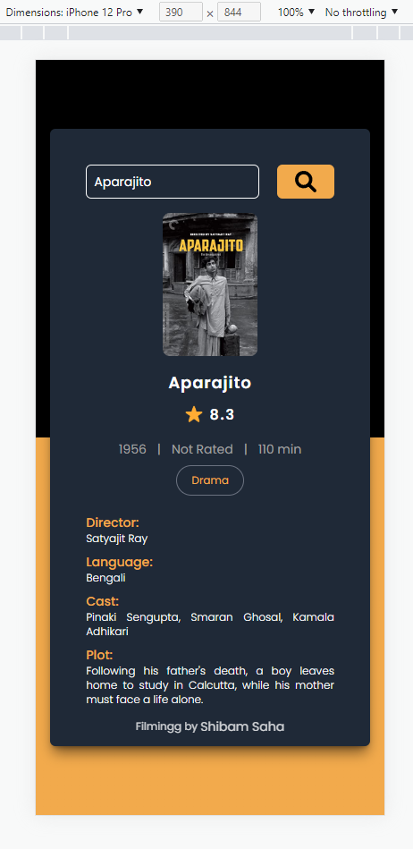

## Filmingg - Movie Searching App

**Details**

- This is a Movie searching / guide web application backed up by [OMDB](https://www.omdbapi.com) API.
- Main working of this app is to fetch and show the Data about any Movie / Series searched by user.
- In the backend the site collects the data from the OMDB API in JSON format and organizes the important data and presents it to the user.
- The application shows significant data in a structured way using DOM Manipulation.
- It also allows to redirect to the Google search result for the given valid details if the Poster image is clicked.
- Beautiful background animation used for better user experience. [Credit](https://codepen.io/Fata-ku/pen/GRJRaj)

 

**Live Link**

- [Filmingg - A Movie Database](https://s4shibam-filmingg.netlify.app)

 

**Tech Stack**

 

**Reference Images / Screenshots**

- Landing Page

- Movie Result

- Movie Result (Poster Not Available)

- Irrelevant Search

- Mobile View

 

**Follow Me**

