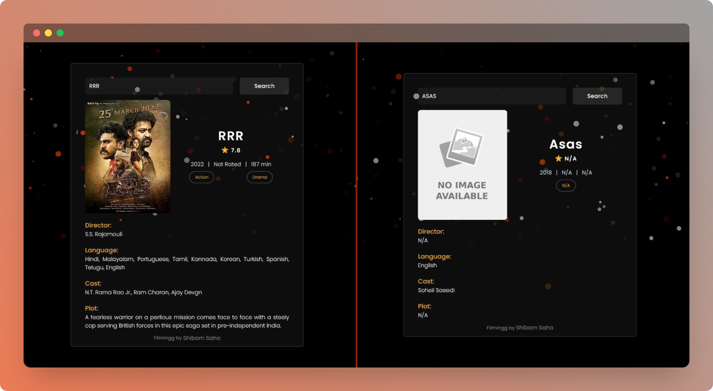

    

    <h1>Filmingg</h1>
    
Movie Searching Web App

    
    

 

## ⚡ Introduction

Filmingg is a Movie searching / guide web application backed up by [OMDB](https://www.omdbapi.com) API.

## ✨ Features
  
-  Responsive UI
-  Show information about movies and series
-  Click the poster image to redirect to the Google search result

## ⚙️ Tech Stack
  
- HTML
- Tailwind CSS
- JavaScript
- Vite JS

## 🎯 Goals

- [x] To experience a CSS framework i.e. Tailwind CSS
- [x] To use `fetch` API for HTTP request and understand the concept of `promise` in JavaScript
- [x] To practically implement an external API service in JavaScript

## ❤️ Acknowledgement

- [Volcanic ash - Background animation](https://codepen.io/Fata-ku/pen/GRJRaj)

## 🖼️ Screenshot

## 👋🏻 Contact

